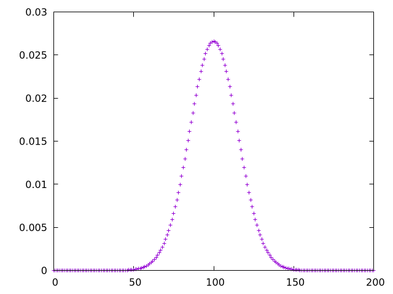

[](https://github.com/HorebParraud/205IQ/graphs/contributors)
[](https://github.com/HorebParraud/205IQ/network)
[](https://github.com/HorebParraud/205IQ/stargazers)
[](https://github.com/HorebParraud/205IQ/issues)
[](https://github.com/HorebParraud/205IQ)
[![LinkedIn][linkedin-shield]][linkedin-url]

<!-- PROJECT LOGO -->
<br />
<p align="center">
  <a>
    
  </a>

  <h1 align="center">205IQ</h1>

  <p align="center">
    EPITECH project - Mathematics
    <br />
    <br />
    <a href="https://github.com/HorepParraud/205IQ/issues">Report Bug</a>
    ·
    <a href="https://github.com/HorebParraud/205IQ/issues">Request Feature</a>
  </p>
</p>


<!-- IMPORTANT -->
## Important!
**If you are seeing this repository, please just ⭐ it! It will not take much time! :)**

<!-- ABOUT THE PROJECT -->
## About The Project

> This project was realized during my second year at EPITECH in 2019

Most of the reference curves, such as weight and height cruves, are created using Gaussian distributions. These curves appear to correctly describe “normality”, and that is why the Gaussian distribution is also called normal distribution. A normal distribution is described by its mean value `µ` and standard deviation `σ` with the following probability density function:

## `f(x) = (1 / (σ√(2π))) * e − ((x−µ)² / 2σ²)`

IQ tests are calibrated so that the results follow a normal distribution. The interpretation of the resulting IQ obviously depends on the calibration of the test. Most of the time, the mean is equal to 100. The standard deviation is usually 15 but can vary (24 in the Cattell test, for example). IQ values are always between 0 and 200.

Your psychiatrist, Dr Von Humleit, plans to create his own IQ test, which is supposed to be better suited to the current population than the classical tests from previous centuries. To help him calibrate his test, you have to program the following tasks:
* given `µ` and `σ`, plot the density function of the IQ for every integer between 0 and 200,
* given `µ`, `σ` and one IQ value, print the percentage of people with an IQ inferior to this value,
* given `µ`, `σ` and two IQ values, print the percentage of people with an IQ in between those values.

### Built With
* Python 3.8

<!-- GETTING STARTED -->
## Getting Started

To get a local copy up and running follow these simple steps.

### Example of an expected response

```sh
∼/HorebParraud/205IQ> ./205IQ 100 15 > data
∼/HorebParraud/205IQ> head -n 2 data
0 0.00000
1 0.00000
∼/HorebParraud/205IQ> head -n 120 data | tail -n 10
110 0.02130
111 0.02033
112 0.01931
113 0.01827
114 0.01721
115 0.01613
116 0.01506
117 0.01399
118 0.01295
119 0.01192
∼/HorebParraud/205IQ> tail -n 2 data
199 0.00000
200 0.00000
```

```sh
~/HorebParraud/205IQ> ./205IQ 100 24 90
33.8% of people have an IQ inferior to 90
```

```sh
~/HorebParraud/205IQ> ./205IQ 100 24 90 95
7.9% of people have an IQ between 90 and 95
```

#### you can use the `drawer.gnu` script to generate a graph from the calculated data:
> install **gnuplot** *(for generate the graph in the png)* with your favorite package manager

```sh
∼/HorebParraud/205IQ> cat drawer.gnu | gnuplot
```


<!--USEFULL LINKS-->
##
[![LinkedIn][linkedin-shield]][linkedin-url] [![GitHub][github-shield]][github-url]

<!-- MARKDOWN LINKS, ALIAS & IMAGES -->
[linkedin-shield]: https://img.shields.io/badge/-LinkedIn-black.svg?style=for-the-badge&logo=linkedin&colorB=555
[linkedin-url]: https://www.linkedin.com/in/horeb-parraud/
[github-shield]: https://img.shields.io/badge/-other_repositories-black.svg?style=for-the-badge&logo=github&colorB=555
[github-url]: https://github.com/HorebParraud?tab=repositories